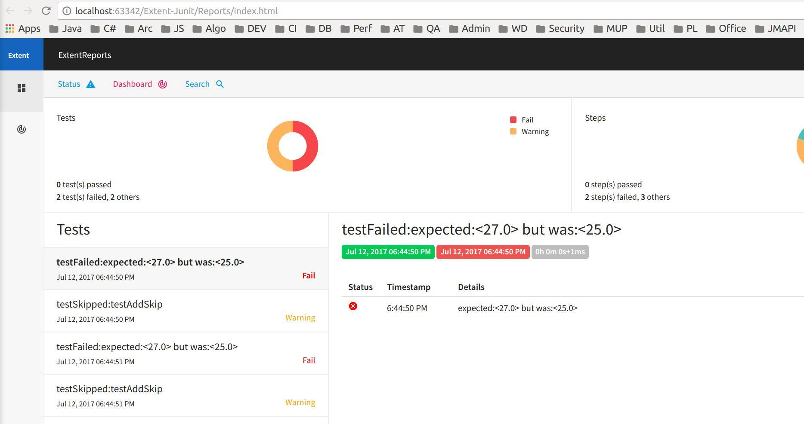
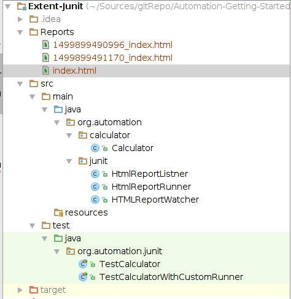

# Extent report example with Junit
Making report with extent

# Target 
We will use custom Junit runner/watcher to create report. 
So that we do not need to manually inject reporting. 
Just annotate our listener to the test class. 

# Ways :
 
 1. Using Junit rules , see HTMLReportWatcher.java
 Limitations : For each test, there will be a report. 
 So, I use current time as prefix to distinguished.
  And I think it is less useful(lot of report will be generated)
 
 2. Using Junit RunListener, see HtmlReportListner.java
 Limitations: As Junit does not listen passed test case, so only failed test cases will be included in the report. 

# main project link 
http://extentreports.com/community/ 

# Run 
1. You can run with you IDE runner (eclipse/intelliJ)
2. With maven : mvn clean test

# Running in IDE 

# Generated Report 
As Junit Makes report for failed/skipped tests 

# Project Structure
