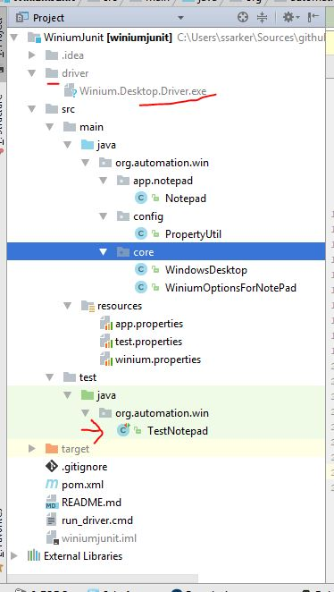
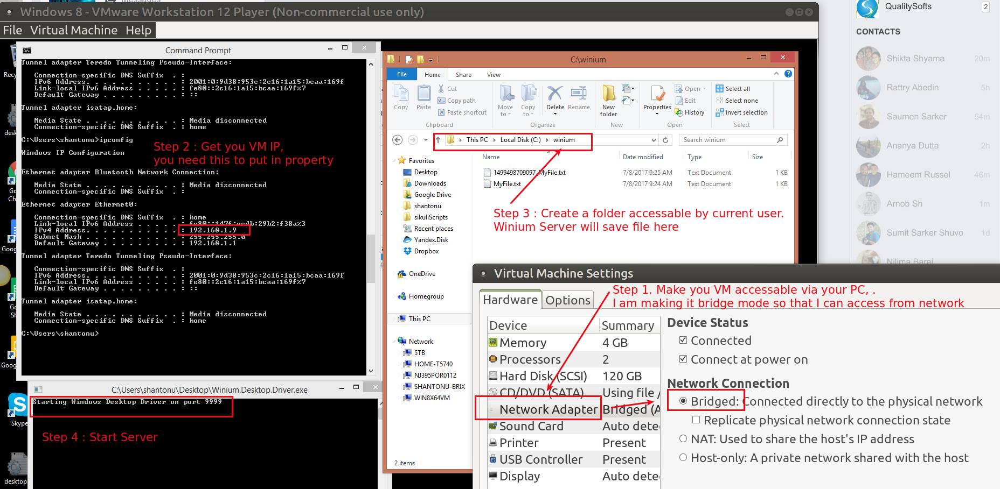
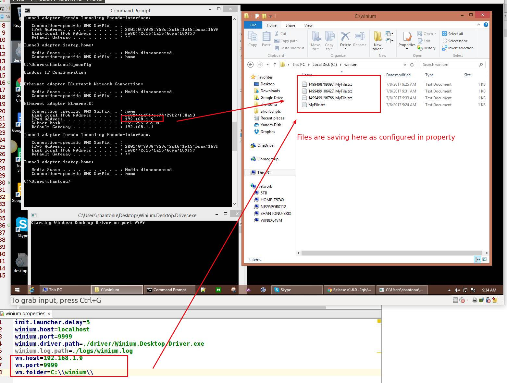

# Example Project with Winium
A simple Project which 

1. opens notepad
2. type a text
3. Save a file to specific location 

# Run Environment 
- Natively Windows 8/10

# Dependency 
Java 
Junit
winium
winium Desktop APP (https://github.com/2gis/Winium.Desktop/releases/download/v1.6.0/Winium.Desktop.Driver.zip)

# Testing command 

- First you need to run Winium Server , there is a command file "run_driver.cmd". 
  RUN THIS COMMAND to run your server. 
  
  Then use maven to test 

- mvn clean test 

# Main Site Link  

- https://github.com/2gis/Winium/tree/master/java

# Running test locally Step by Step
 
1. Download this project 
2. Download Winium Desktop APP 
3. Create a folder in & put this desktop app
4. Run the server (or you can use my script)

5. Run the test 

# Project Structure 

# How to run Remotely (step by Step) 

- Example : I will run with win8 VM

- Step 1 : Create a windows VM & make it accessible via intranet. 
I use VmWare, network in bridge mode so that I can access from other PC in network. 
 
- Step 2 : Get the IP address of the VM 

- Step 3 : Create a folder which has permission to save file. 
I create C:\winium\ and allowed current user (me) and admins to have full access. 

- Step 4 : Start Winium Server in VM 

- Step 5 : (optional) Now add IP, Port & folder in project as property. 

  
  
And Run it as Junit test from you Linux Host...  Done :)   
 
